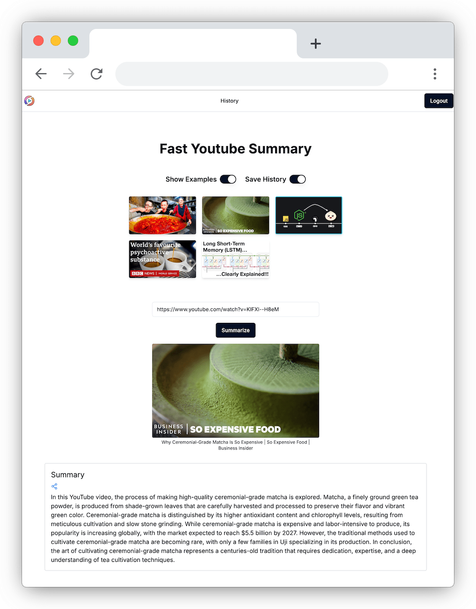

# Fast YouTube Summary

Summarizes Youtube videos fast + free



## Installation
To install, follow these steps:

1. Clone the repository:
    ```
    git clone https://github.com/adnjoo/fast-youtube-summary.git
    ```

2. Navigate to the project web folder:
    ```
    cd fast-youtube-summary/web
    ```

3. Make `.env` file like:
    ```bash
    OPENAI_KEY=..
    ```

## Usage
To use the Youtube Summarizer, follow these steps:

1. Run the application:
    ```
    npm run dev
    ```

## Contributing
Contributions are welcome! If you have any ideas, suggestions, or bug reports, please open an issue or submit a pull request.

## License
This project is licensed under the MIT License. See the [LICENSE](/LICENSE) file for more information.


